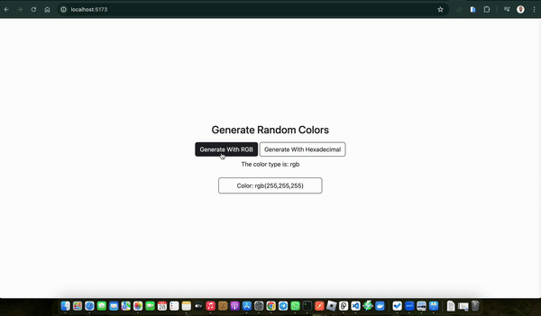

## Sneak Peek



# React Random Color Picker

## Description

> This project is a simple React component that generates a random color each time a button is clicked. It's a great way to practice state management and event handling in React.

## Live Demo Link

[Project Link](https://github.com/odhiambo-ed/react-random-color-picker.git)

## Built With


## Features

- Generates a random color on button click
- Displays the generated color in a styled box
- Shows the hex code of the generated color

## Get Started

### Run

```
To get a clone of the project, run `https://github.com/odhiambo-ed/react-random-color-picker.git`
```

```
cd /react-random-color-picker
```

```
npm install
```

```
npm start
```


## Author(s)

  <a href="https://github.com/odhiambo-ed" target="blank"></a>   **Edward Odhiambo**

- GitHub: [@whit3d](https://github.com/odhiambo-ed)
- Twitter: [@odhiambo_ed](https://twitter.com/odhiambo_ed)
- LinkedIn: [Edward Odhiambo](https://www.linkedin.com/in/edward-odhiambo/)
- Portfolio: [Edward Odhiambo](https://edwardodhiambo.com/)

## 🤝 Contributing

Contributions, issues, and feature requests are welcome!!!

Feel free to check the [issues page]https://github.com/odhiambo-ed/react-random-color-picker/issues)

## Show your support

Give a ⭐️ if you like this project!

## Acknowledgments

- Hat tip to anyone whose code was used
- Special thanks to [React](https://react.dev/) for the amazing vanilla JavaScript framework project. I am grateful for your talent and generosity in sharing your work with the community.

## 📝 License

This project is [MIT](https://github.com/white3d/GitHub-User-Content/blob/main/LICENSE) licensed.

